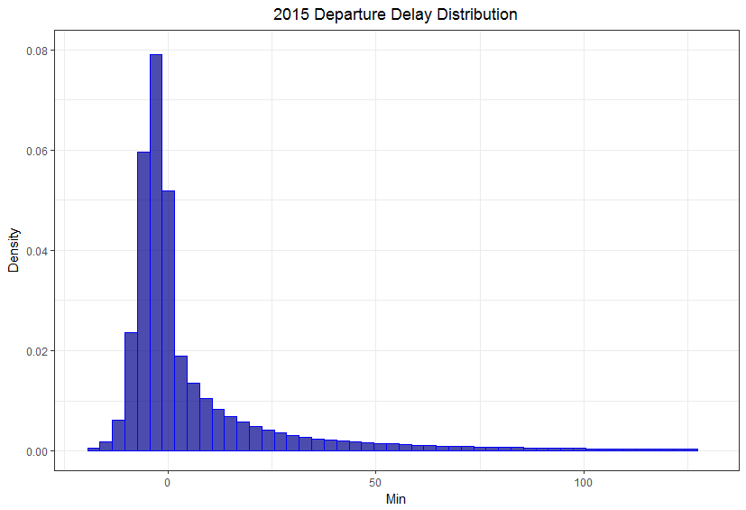
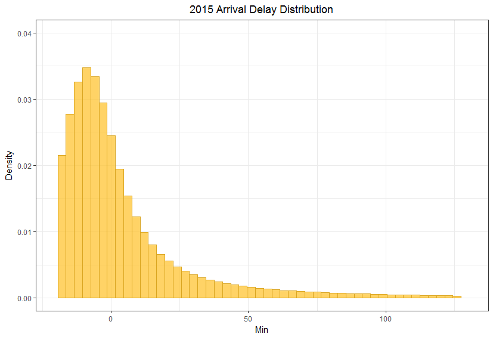
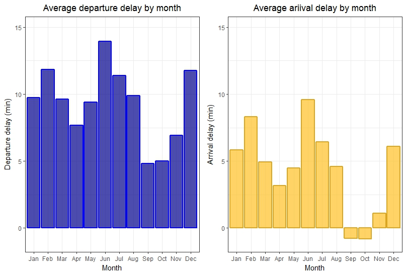
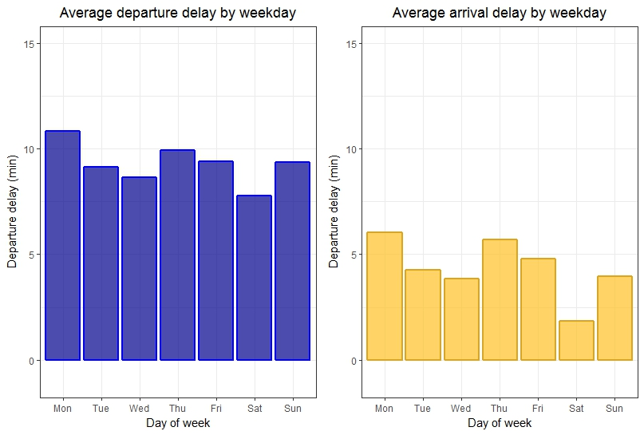
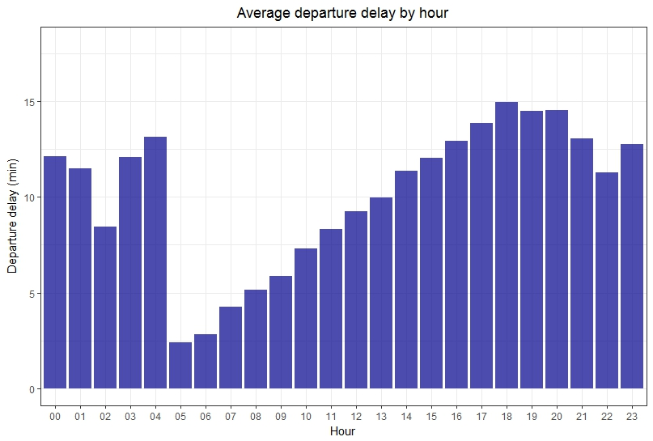
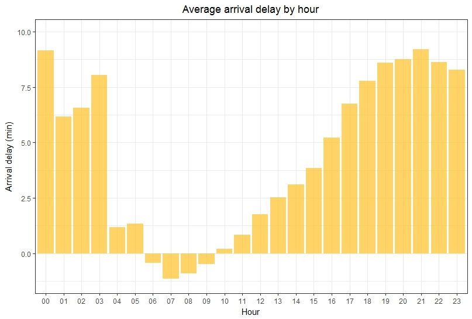
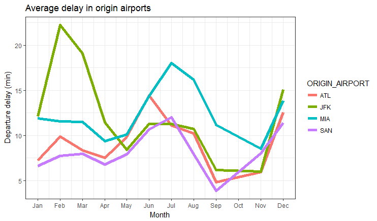
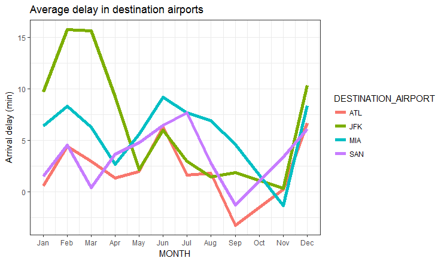

# Project Description and Expectation

### *Goal:*
  Predict probable cancellation or delay of a flight so it could allow customers to be informed beforehand faster and more accurately and investigate data to find some interesting relationship in it.

### *Expected result:* 
  The aircraft companies and airports could provide better customer service using the information of future disruptions that might happen. In addition, it will help passengers to be prepaired for some unexpceted problems during their trip.   

# Data input and exploration

### *Data Input:*
  
  The U.S. Department of Transportation's (DOT) Bureau of Transportation Statistics tracks the on-time performance of domestic flights operated by large air carriers. Summary information on the number of on-time, delayed, canceled, and diverted flights is published in DOT's monthly Air Travel Consumer Report and in this dataset of 2015 flight delays and cancellations.
  As the initial dataset we analyzed data from <a href="https://www.kaggle.com/usdot/flight-delays">Kaggle</a> that was collected and published by the DOT's Bureau of Transportation Statistics. 
  
### *Data Cleaning:*

  Initial dataset contains $5819079$ rows containing information regarding flights delays in USA in 2015. We decided to get rid of flights that was cancelled or diverted, because they are not giving us information that we need. It is obvious that cancelled or diverted flight cant be delayed, thus we dont need them.
  
```{r, eval=FALSE}
cleanedData <- data[data$CANCELLED != 1,]
cleanedData <- data[data$DIVERTED != 1,]
```

  After that we decided to substract rows which are related to airports that are has less then 20 flights daily. After this operations our working dataset contains $5788666$ rows. 
  
```{r, eval=FALSE}
# Function to count amount of flights in unique airport
airportFlightsCounter <- function(airports) {
  busyAirports <- c()
  index <- 0
  for(airport in airports) {
    amount_of_flights <- (nrow(cleanedData[cleanedData$ORIGIN_AIRPORT == airport,])+nrow(cleanedData[cleanedData$DESTINATION_AIRPORT == airport,]))/365
    if(amount_of_flights > 20) {
      busyAirports <- c(busyAirports, airport)
    }    
  }  
  return(busyAirports)
}

#Data filtering
cleanedData <- filter(cleanedData, cleanedData$ORIGIN_AIRPORT %in% airportWithMoreThen20Flights | cleanedData$DESTINATION_AIRPORT %in% airportWithMoreThen20Flights)

```

#Data Exploration

1) Firstly, we decided to observe probability of the delay from different aspects like day of the week, month, hour and airports. We observed arrival and departure details using histogram and bar plots.




  From this two plots we can clearly see that most of the delays are negative or centerize in the 0.It means that most of the flight depart or landed just in time or even beforehand. Also, we can notice that there are long tails, that means that there are flights that are delayed up to 2 hours. 
  We considered delay as the time difference between schedule time and actual time. Airlines usually includes time buffer - extra time, to flight duration to be sure that flight will arrive on time. From plots above we can see that some departure delays are recovered due to some extra time that was described.Thus, it make sense to represtent separetly departure and arrival time distribution, because they effected by different reasons.
  We can see from the plot that data normal distribution but it is biased to the left.

  Lets take a look at the departure and arrival delay distribution by months



  Here we can see that delays depend on season. Taking into the considiration the season distribution it is clearly seen that winter and summer season have the biggest departure delays. We can assumed that delays on winter are cause by weather condition and as for summertime delays are caused by enormous passenger traffic ( vacation time). In the fall the departure delays are minimum.
  If we look at arrival distribution it is quite similiar, the summer and winter season has the biggest values. What is more, in September and October month the mean arrival delay is even below the zero, that means that most of the flight are arrived earlier. As we mention before, it is connected with low flight traffic.
  
  Also, the distribution by week are important and this visualization can lead to interesting information.


  
  As we can see from the these distribution dat of the week has no influance of the delays. Moreover, we expect to see that on Friday, Saturday and Sunday have the most biggest delay of the week, but they are quite similar to other days. What is more, even the arrival delay on Saturday has the lowest value of the week. Arrival delay is almost in two times smaller than departure delay which is quite unexpected these can be explained by the time gap that airlines includes into the flight time.
  
  Lets now look at the distribution by hour for arrival and departure delays. We expect that delays will influeance for later delays by propagating through the day.
  


  As we expected - the departure delay accumulate from the earlier morning hours with peak of 18-19 hour.In addition starting from 4 to 5 there is a huge gap in delays.




  In constrast to the departure delay the distribution of arrival delay significally differs. Starting from 10 o'clock delays starting accummulating until to the next day at 3. What is more, 6-9 hours have even negative arrival delays that means that most of the flight arrival earlier than planned.The distribution of arrival delay by hour has a "V" shape.
  As a conclusion, the distribution of delays by hour are differ the most, thus it is one of the best canditate to be good predicor of delay. 


2) The four big airports San Diego International Airport, JFK - John F. Kennedy International Airport, Miami International Airport, Atlanta International Airport(SAN, JFK, MIA, ATL) are selected to show the difference of average delay time between them. Origin and arrival delays are analysed and displayed separetely.



From average delay in origin airports plot we can see that peak delays for JFK is in february. JFK is situated near New York which is in northern part of US, therefore weather conditions in winter there are difficult, which causes delays. Second peak of the plot refers to MIA airport in July. It is quite logical, because Miami is in souther part of US and it is a popular tourist place, therefore passenger traffic should increase for this airport in summer, which causes higher delays.



From average delay in destination airports we can see that JFK has the highest destination delays among other airports and they are in february and march. In addition, delay in destination airports are slightly lower then delays in origin airports because of time gap which is embedded into flight time. 

